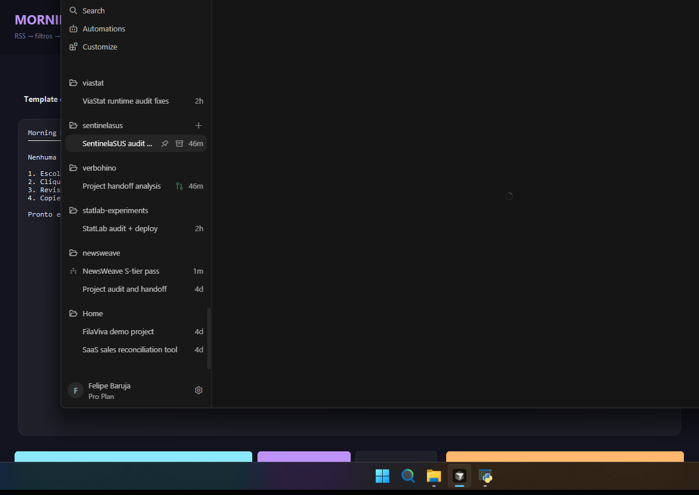
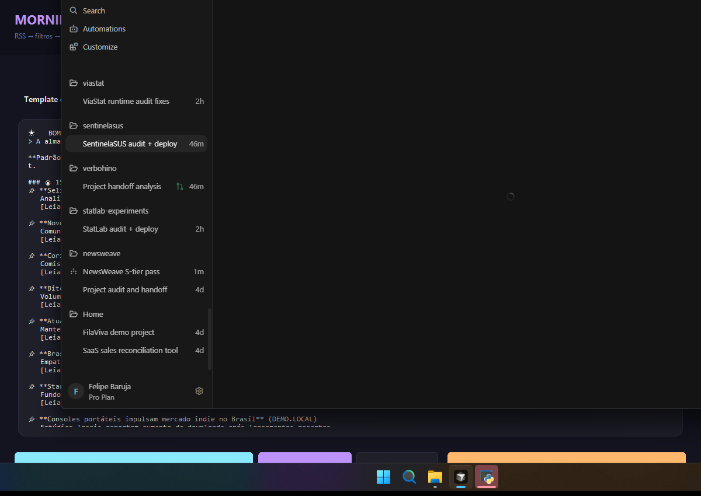
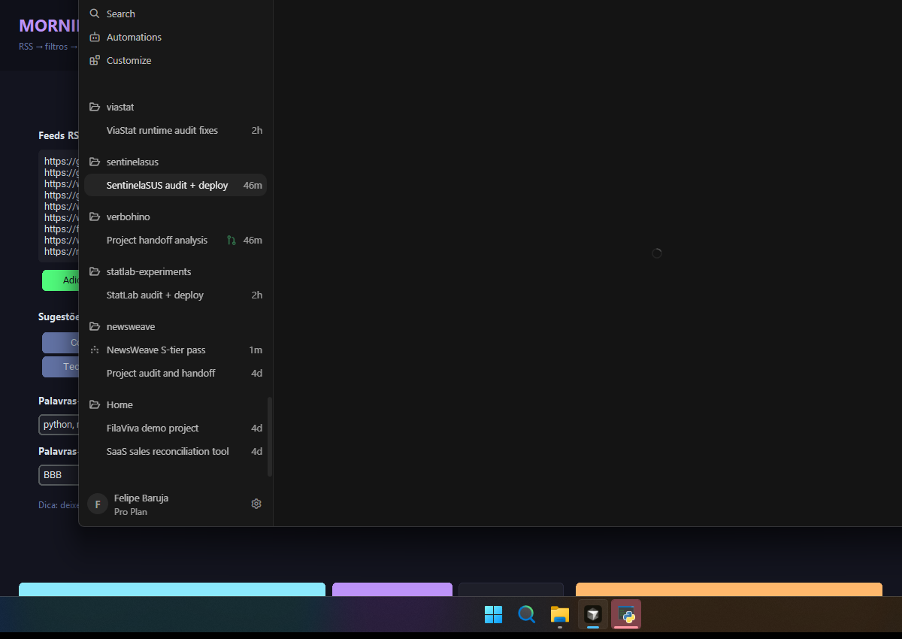

# Coletor — empty / onboarding


# Coletor — DEMO OFFLINE (fixtures, sem PII)


# Configurações — feeds + filtros


# Manifest

See [MANIFEST.md](./MANIFEST.md). Regenerate with:

```bash
pip install pillow
python scripts/capture_screenshots.py
```
